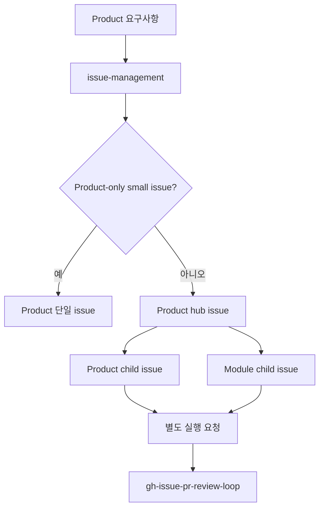
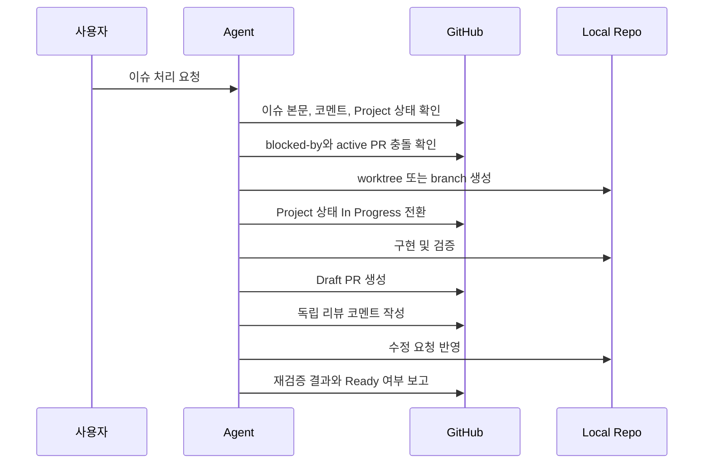
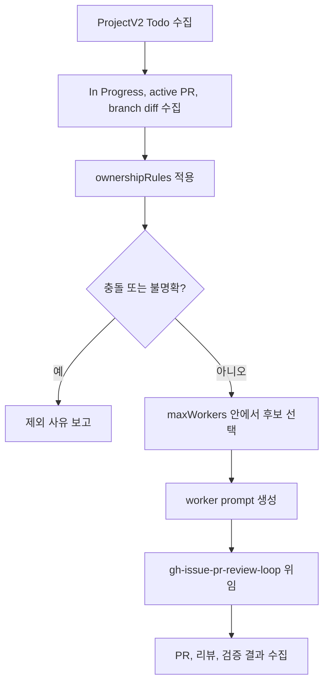

# VIRNECT Skills 실제 운영 워크플로우 온보딩

이 문서는 `VIRNECT Skills` 플러그인을 처음 도입하는 사람이 실제 운영 흐름을 빠르게 이해하고 따라 할 수 있도록 정리한 온보딩 문서다.
핵심은 자연어로 들어온 요구사항을 GitHub 이슈 큐로 정리하고, 충돌 없는 작업만 PR까지 진행하며, 반복 가능한 부분은 ProjectV2 `Todo` 자동화로 넘기는 것이다.

## 전체 흐름


사용자가 직접 고르는 기본 진입점은 둘이다. 이슈 등록은 `issue-management`, 작업 실행은 `gh-issue-pr-review-loop`로 요청한다. 단일 repo인지 multi repo인지는 스킬이 판단한다.

| 스킬 | 사용하는 시점 | 결과물 |
|------|---------------|--------|
| `issue-management` | 요구사항을 이슈로 등록하거나 기존 이슈를 정리할 때 | 작업 가능한 GitHub 이슈, 상태, 관계, 검증 계획 |
| `gh-issue-pr-review-loop` | 특정 이슈를 실제 코드 변경과 PR로 끝낼 때 | 브랜치, 커밋, PR, 리뷰 코멘트, 수정 반영 결과 |
| `todo-issue-automation` | ProjectV2 `Todo` 큐에서 충돌 없는 작업을 반복 선별할 때 | worker 위임 결과, 제외 사유, PR/검증/리뷰 보고 |
| `multi-repo-issue-orchestration` | 내부 helper 또는 고급 디버깅이 필요할 때 | product hub issue, repo별 child issue, product local package override 판단 보조 |

모든 GitHub-visible 이슈, PR, 코멘트, 리뷰, 최종 보고는 한국어로 작성한다.

## 실제 운영 모델

운영은 처음부터 자동화를 고려해 설계한다. 다만 자동화가 모든 판단을 대신하는 것은 아니다.

1. 사람이 자연어 요구사항을 준다.
2. `issue-management`가 요구사항을 합치거나 나누고, `Todo` 또는 `Issue Review`로 분류한다.
3. 바로 구현 가능한 이슈만 ProjectV2 `Todo` 큐에 들어간다.
4. `todo-issue-automation`이 `Todo` 전체를 무조건 배정하지 않고, active PR과 ownership 충돌을 확인한다.
5. 충돌 없는 이슈만 worker에게 넘긴다.
6. worker는 `gh-issue-pr-review-loop`로 PR과 리뷰 루프까지 닫는다.

실제 사용에서 중요한 기준은 "이슈 상태"보다 "실제 작업 충돌 가능성"이다. `Todo` 상태여도 열린 `blocked-by`가 있거나, active PR이 같은 화면, DTO, service, repository, fixture, generated file을 수정 중이면 위임하지 않는다.

## 0. Product hub issue 자동 분류

사용자는 product 요구사항이 단일 repo인지 multi repo인지 구분하지 않는다. `$issue-management ... 이슈 등록`으로 요청하면 스킬이 요구사항을 group으로 나누고, 필요할 때 `multi-repo-issue-orchestration` helper를 읽어 product hub issue와 repo별 child issue를 구성한다. 등록 단계에서는 issue, Project field, relationship만 만들고 PR/worktree/package override는 실행하지 않는다.



단일 issue로 충분한 조건은 모두 만족해야 한다.

- product repo 변경만 있다.
- 독립 완료 기준이 1개다.
- module package, API, DB, DTO, protocol 변경이 없다.
- profile의 `singleIssueMaxEstimateHours` 이하로 끝난다.

그 외에는 hub issue와 repo별 child issue로 나눈다. 한 번에 여러 요구사항이 들어오면 hub issue도 여러 개 생길 수 있다. child issue 작업과 product local package override는 별도 실행 요청에서만 진행한다.

profile 위치:

```text
<product-repo>\.codex\multi-repo-issue-orchestration\profiles\<profile-id>.json
$CODEX_HOME\automation-profiles\multi-repo-issue-orchestration\<profile-id>.json
```

처음 도입하는 product 저장소에서는 agent에게 profile 초기화를 요청한다. agent는 module 후보를 탐색하고, 수정 가능한 module과 package override 방식을 사용자에게 확인한 뒤에만 profile을 생성한다. 확인되지 않은 필수 값이 있으면 빈 JSON을 만들지 않고 질문과 후보 목록만 보고한다.

```text
product 저장소에서 multi-repo profile 초기화해줘.
수정 가능한 module 후보와 product local test package override 방식은 확인 후 profile로 만들어줘.
```

고급 디버깅용 initializer:

```powershell
.\plugins\virnect-skills\skills\multi-repo-issue-orchestration\scripts\init-profile.ps1 `
  -Profile product-suite `
  -ProductRepoRoot D:\Git\Products\Product
```

고급 디버깅용 renderer:

```powershell
.\plugins\virnect-skills\skills\multi-repo-issue-orchestration\scripts\render-hub-prompt.ps1 `
  -Profile product-suite `
  -Action Register `
  -ProductRepoRoot D:\Git\Products\Product
```

프롬프트 예시:

```text
$issue-management로 아래 product 요구사항을 이슈로 등록해줘. 단일 repo인지 multi repo인지는 직접 판단해줘. 등록 단계에서는 PR/worktree/package override 실행은 하지 마.

요구사항:
- Product 화면에서 module-a의 새 inspection API 결과를 표시해야 함
- module-a package의 응답 DTO와 parser도 수정 필요
- 사용자가 product local 환경에서 module-a 작업 branch로 통합 테스트할 수 있어야 함
```

## 1. 자연어 요구사항을 이슈로 바꾸기

사용자는 처음부터 정리된 이슈 단위로 요구하지 않는다. 보통 아래처럼 여러 도메인의 요구가 한 번에 들어온다.

```text
관리자 화면 개선 요구사항:

- 사용자 목록에서 이름, 권한, 활성 여부로 필터링하고 필터 상태를 URL에 유지해줘.
- 사용자별 접속 이력을 볼 수 있는 API가 필요해.
- 접속 이력 목록을 CSV로 다운로드하고 싶어.
- 사용자 목록이 5,000건 이상이면 렌더링이 너무 느려.
- 비활성 사용자를 저장할 때 간헐적으로 중복 키 오류가 난다는 로그가 있어.
- 관리자 매뉴얼에도 새 필터와 CSV 다운로드 방법을 반영해줘.
```

`issue-management`는 이 입력을 단일 이슈로 뭉개지 않는다. 먼저 같은 원인으로 해결되는 항목과 독립 완료 기준이 있는 항목을 분리한다.

| 입력 항목 | 판단 | 이슈화 결과 |
|-----------|------|-------------|
| 사용자별 접속 이력 API | CSV와 UI가 의존하는 공통 계약 | API 계약 및 조회 기능 이슈 |
| 사용자 목록 필터와 URL 동기화 | 독립 UI 작업이지만 API 조건과 맞아야 함 | 관리자 사용자 목록 필터 UI 이슈 |
| 접속 이력 CSV 다운로드 | API 응답 형식에 의존하는 별도 기능 | CSV 다운로드 이슈 |
| 5,000건 이상 목록 렌더링 저하 | 측정 기준과 목표 성능이 불명확 | `Issue Review` 성능 측정 이슈 |
| 중복 키 오류 | UI 증상과 서버 로그가 같은 저장 root cause | canonical 버그 이슈 |
| 관리자 매뉴얼 갱신 | 기능 완료 후 반영하는 문서 작업 | 문서 갱신 이슈 |

분해 결과는 다음처럼 구성한다.

| 이슈 | 상태 | 관계 | 이유 |
|------|------|------|------|
| 관리자 접속 이력 API 계약 및 조회 구현 | `Todo` | 선행 이슈 | UI와 CSV가 의존하는 API/DTO 계약을 먼저 고정해야 한다. |
| 관리자 사용자 목록 필터 UI 개선 | `Todo` | `blocked-by` API 계약 | 필터 query와 응답 필드가 API 계약에 맞아야 한다. |
| 접속 이력 CSV 다운로드 | `Todo` | `blocked-by` API 계약 | 다운로드 대상 필드와 권한 정책이 API 계약에 의존한다. |
| 사용자 목록 대량 렌더링 성능 기준 확정 | `Issue Review` | related | 5,000건 기준의 목표 시간, 측정 환경, 허용 지연이 필요하다. |
| 비활성 사용자 저장 중복 키 오류 수정 | `Todo` | canonical | UI 증상과 DB 오류 로그를 하나의 저장 경로 버그로 묶는다. |
| 관리자 매뉴얼 갱신 | `Todo` | `blocked-by` UI/CSV | 기능이 merge된 뒤 실제 화면 기준으로 문서를 갱신한다. |

### 합치기 기준

다음 조건이면 새 이슈를 만들기보다 canonical issue 하나로 묶는다.

- 같은 root cause로 해결된다.
- 같은 API, DB, DTO, UI 흐름, 저장 경로를 수정한다.
- 하나의 PR에서 함께 수정해야 일관성이 유지된다.
- 기존 open issue가 같은 문제를 이미 다루고 있고 최신 요구사항만 부족하다.

예를 들어 "비활성 사용자 저장 실패"와 "중복 키 DB 로그"는 서로 다른 표현이지만 같은 저장 경로 문제라면 canonical 버그 이슈 하나로 합친다.

### 나누기 기준

다음 조건이면 parent/sub-issue 또는 독립 이슈로 나눈다.

- 프론트엔드, 백엔드, 문서, 성능 검증처럼 도메인이 다르다.
- 공통 API/DTO/DB 계약이 먼저 정해져야 한다.
- 한 PR에 넣으면 리뷰 범위가 커진다.
- 담당자, 검증 환경, 배포 타이밍이 다르다.
- 병렬 작업이 가능하지만 파일/ownership 충돌은 피해야 한다.

### `Issue Review`로 두는 기준

아래처럼 구현자가 판단할 수 없는 정보가 남으면 `Todo`로 보내지 않는다.

- 성능 목표와 측정 환경이 없다.
- API 응답 필드나 데이터 보존 정책이 불확실하다.
- UI 동작이 여러 방향으로 해석된다.
- 재현 조건이 부족하다.
- Assignees, milestone, Project, Size, Estimate 같은 필수 메타데이터를 신뢰할 수 없다.
- 단일 이슈의 Estimate가 18시간을 넘는데 더 작은 작업 단위로 분리되지 않았다.

이 경우 이슈 본문 또는 코멘트에는 필요한 질문과 추천 답변을 남기고, 범위가 확정되기 전까지 작업 위임 대상에서 제외한다.

### UI 이슈에는 ASCII 레이아웃을 넣는다

UI 변경은 말로만 설명하면 해석이 갈릴 수 있다. 이슈 본문에 간단한 예상 레이아웃을 넣는다.

```text
+------------------------------------------------------+
| 관리자 사용자 목록                                    |
+------------------------------------------------------+
| 이름 [________] 권한 [전체 v] 활성 [전체 v] [검색]    |
| URL query: ?name=&role=&active=                       |
+------------------------------------------------------+
| 사용자명 | 권한 | 활성 여부 | 마지막 접속 | 작업       |
|----------|------|-----------|-------------|------------|
| ...                                                  |
+------------------------------------------------------+
| [접속 이력 보기] [CSV 다운로드]                       |
+------------------------------------------------------+
```

### `issue-management` 프롬프트 예시

`issue-management`에는 중복 검색, canonical 통합, 하위 이슈 분리, `blocked-by`, `Issue Review`, 본문 템플릿, Project 상태와 Assignees/Size/Estimate 검증 규칙이 이미 들어 있다.
따라서 일반적인 이슈 등록 요청에서는 요구사항과 저장소/프로젝트 맥락만 주면 충분하다.

```text
$issue-management로 아래 요구사항 묶음을 GitHub 이슈로 정리해줘.

요구사항:
- 사용자 목록에서 이름, 권한, 활성 여부로 필터링하고 URL query에 유지
- 사용자별 접속 이력 API 추가
- 접속 이력 CSV 다운로드
- 5,000건 이상 목록 렌더링이 느림
- 비활성 사용자 저장 중 중복 키 오류 발생
- 관리자 매뉴얼 갱신
```

추가 요청은 스킬 기본 동작을 반복하기 위해서가 아니라, 이번 작업에서만 특별히 강조하거나 기본값을 바꾸고 싶을 때 넣는다.

```text
$issue-management로 아래 요구사항을 이슈화해줘.

요구사항:
<요구사항 목록>

요청:
- 이번에는 성능 이슈를 별도 이슈로 만들지 말고, 먼저 측정 질문만 정리해줘.
- 관리자 문서 갱신은 기능 PR이 merge된 뒤 처리할 후속 이슈로 분리해줘.
- 기존 이슈 #123이 관련되어 있으면 canonical 여부를 우선 판단해줘.
```

## 2. 이슈를 PR까지 끝내기

이슈가 작업 가능한 상태가 되면 `gh-issue-pr-review-loop`를 사용한다.



작업 전에는 항상 preflight를 먼저 본다.

```powershell
$codexHome = if ($env:CODEX_HOME) { $env:CODEX_HOME } else { Join-Path $HOME ".codex" }
$preflight = Join-Path $codexHome "skills\issue-management\scripts\gh-issue-preflight.ps1"
if (-not (Test-Path -LiteralPath $preflight)) {
  $preflight = ".agents\skills\issue-management\scripts\gh-issue-preflight.ps1"
}

& $preflight -Issue <issue-number> -Mode Startup -Json
& $preflight -Issue <issue-number> -Mode StatusTransition -Json
& $preflight -Issue <issue-number> -Mode PrConflict -Json
```

해석 규칙은 보수적으로 둔다.

- 열린 `blocked-by`가 있으면 시작하지 않는다.
- `partial=true` 또는 `skippedLookups`가 있으면 충돌 없음으로 보지 않는다.
- active PR이 같은 화면, DTO, service, repository, fixture, generated file을 건드리면 병렬 착수를 보류한다.
- PR 발행 직전에는 `PrConflict`로 local diff와 active PR 변경 파일을 다시 비교한다.
- 테스트 실패는 baseline 실패와 이번 변경 회귀를 분리해 보고한다.

### `gh-issue-pr-review-loop` 프롬프트 예시

```text
$gh-issue-pr-review-loop로 #123을 처리해줘.

요청:
- 착수 전에 blocked-by 관계와 active PR 파일 충돌을 확인해줘.
- 착수 가능하면 codex/issue-123-admin-access-log 브랜치를 만들어줘.
- ProjectV2를 사용한다면 In Progress 또는 저장소의 동등 상태로 전환해줘.
- 구현 후 변경 범위에 맞는 테스트를 실행해줘.
- PR은 Draft로 만들고 본문 초반에 요약 작업 목록을 한국어로 작성해줘.
- 독립 코드리뷰를 수행해서 GitHub PR에 리뷰 코멘트를 남겨줘.
- 수정 요청이 있으면 반영하고 재검증한 뒤 Ready for review 전환 여부를 판단해줘.
- merge는 하지 마.
```

## 3. Todo 큐 자동화로 반복 작업 운영하기

`todo-issue-automation`은 ProjectV2 `Todo` 큐를 읽고 worker에게 일을 나누는 상위 운영 스킬이다.
핵심은 "많이 배정"이 아니라 "충돌 없는 후보만 배정"이다.



자동화는 다음 데이터를 profile JSON에서 읽는다. repo별 값은 프롬프트에 하드코딩하지 않는다.

```json
{
  "id": "admin-platform",
  "displayName": "Admin Platform Todo Automation",
  "repoFullName": "owner/repo",
  "repoUrl": "https://github.com/owner/repo",
  "sourceRoot": "D:\\Git\\Projects\\Repo",
  "projectOwner": "owner",
  "projectNumber": 1,
  "projectTitle": "Admin Platform",
  "baseBranch": "master",
  "todoStatusName": "Todo",
  "inProgressStatusName": "In Progress",
  "maxWorkers": 3,
  "worktreePrefix": "admin-platform-todo",
  "branchPrefix": "codex/automation/admin-platform-todo",
  "repoInstructionPaths": ["AGENTS.md", ".github/copilot-instructions.md"],
  "preflightArgs": {
    "Repo": "owner/repo",
    "ProjectOwner": "owner",
    "ProjectNumber": 1,
    "Base": "master"
  },
  "ownershipRules": [
    "same admin user list screen",
    "same access log API contract",
    "same user DTO/model",
    "same user repository or migration",
    "same E2E fixture or generated file"
  ],
  "validationRules": [
    "Run changed-area tests first.",
    "Run broader validation when API, DB, or shared UI contracts change.",
    "Separate baseline failures from regressions introduced by this change."
  ],
  "reportingRules": [
    "Report selected issues and exclusion reasons.",
    "Report PR URLs, verification results, review comments, and blockers."
  ]
}
```

profile 위치는 둘 중 하나를 사용한다.

```text
<target-repo>\.codex\todo-issue-automation\profiles\<profile-id>.json
$CODEX_HOME\automation-profiles\todo-issue-automation\<profile-id>.json
```

renderer로 automation prompt를 만든다.

```powershell
.\plugins\virnect-skills\skills\todo-issue-automation\scripts\render-automation-prompt.ps1 `
  -Profile admin-platform `
  -RepoRoot D:\Git\Projects\Repo
```

### 자동화 선별 예시

| Todo 후보 | 예상 수정 범위 | 판단 | 이유 |
|-----------|----------------|------|------|
| 접속 이력 CSV 다운로드 | CSV service, access log API response | 선택 | active PR과 파일/ownership이 겹치지 않는다. |
| 사용자 목록 필터 UI | 관리자 사용자 목록 화면 | 제외 | active PR이 같은 화면의 table state를 수정 중이다. |
| 사용자 저장 중복 키 오류 | user repository, DB constraint | 선택 | API/UI active PR과 충돌 가능성이 낮고 root cause가 독립적이다. |
| 대량 렌더링 성능 개선 | 목록 virtualization 여부 불명확 | 제외 | 목표 성능과 접근 방식이 확정되지 않았다. |
| 관리자 문서 갱신 | docs/admin-guide.md | 보류 | UI/CSV 기능 PR merge 이후 실제 화면 기준으로 작성해야 한다. |

자동화는 제외된 이슈를 실패로 보지 않는다. 충돌과 불명확성을 피하고, 왜 제외했는지 보고하는 것이 정상 동작이다.

### `todo-issue-automation` 프롬프트 예시

```text
$todo-issue-automation으로 admin-platform profile을 사용해 Todo 이슈를 선별하고 worker에게 위임해줘.

요청:
- profile의 repo, Project, base branch, status 이름, ownershipRules, validationRules를 사용해줘.
- In Progress 이슈, active PR, 연결 branch diff를 먼저 확인해줘.
- Todo 후보의 예상 수정 범위를 추정하고 신뢰도를 기록해줘.
- active 수정 범위와 ownership이 겹치는 후보는 제외해줘.
- 불명확한 후보는 worker에게 넘기지 말고 필요한 확인 사항을 보고해줘.
- 선택한 이슈만 maxWorkers 범위 안에서 worker에게 위임해줘.
- worker는 gh-issue-pr-review-loop와 필요 시 issue-management를 사용하게 해줘.
- merge는 하지 말고 PR, 리뷰, 검증, 제외 사유를 한국어로 보고해줘.
```

## 4. Codex 도입 설정

Codex에서는 플러그인 구조가 다음과 같아야 한다.

```text
<skills-repo>
├─ .agents\plugins\marketplace.json
└─ plugins\virnect-skills
   ├─ .codex-plugin\plugin.json
   └─ skills
      ├─ issue-management\SKILL.md
      ├─ gh-issue-pr-review-loop\SKILL.md
      ├─ todo-issue-automation\SKILL.md
      ├─ multi-repo-issue-orchestration\SKILL.md
      └─ ascii-art\SKILL.md
```

기본 도구를 확인한다.

```powershell
git --version
gh --version
rg --version
```

GitHub 인증과 repo 접근을 확인한다.

```powershell
gh auth status
gh repo view --json nameWithOwner,defaultBranchRef
git status --short --branch
```

ProjectV2와 relationship까지 사용하려면 GitHub 계정 또는 GitHub App에 다음 권한이 필요하다.

- 대상 저장소 issue/PR 읽기 및 쓰기
- branch push 권한
- GitHub ProjectV2 읽기 및 쓰기
- GraphQL mutation 실행 권한
- `addSubIssue`, `addBlockedBy` relationship mutation 사용 가능 권한

Codex 프롬프트에서는 스킬명을 직접 호출한다.

```text
$issue-management로 아래 요구사항을 이슈화해줘.
```

```text
$gh-issue-pr-review-loop로 #123을 작업해서 PR과 리뷰 루프까지 마무리해줘.
```

```text
$todo-issue-automation으로 <profile-id> profile을 사용해 Todo 후보를 선별하고 위임해줘.
```

## 5. Claude 도입 설정

Claude에서는 Codex 플러그인 설치 구조가 그대로 동작하지 않을 수 있다. 같은 운영 규칙을 `CLAUDE.md`와 custom command로 옮긴다.

권장 구조:

```text
<target-repo>
├─ CLAUDE.md
└─ .claude
   └─ commands
      ├─ issue-plan.md
      ├─ issue-pr-loop.md
      └─ todo-automation.md
```

`CLAUDE.md`에는 공통 운영 규칙을 넣는다.

```markdown
# Workflow Instructions

사용자가 확인하는 이슈, PR, 코멘트, 리뷰, 보고는 한국어로 작성한다.

요구사항 정리는 issue-management 방식으로 처리한다.
- 새 이슈 생성 전 중복 이슈를 확인한다.
- 같은 root cause나 같은 API/UI/DB 계약은 canonical issue로 통합한다.
- 독립 완료 기준이 있으면 parent/sub-issue 또는 독립 이슈로 분리한다.
- 선행 작업이 필요하면 blocked-by 관계를 설정한다.
- 작업 이유, 목적, 작업 계획, 완료 기준, 검증 계획을 포함한다.
- 질문이 남으면 Todo로 보내지 말고 Issue Review로 둔다.

이슈 구현은 gh-issue-pr-review-loop 방식으로 처리한다.
- 착수 전 blocked-by와 active PR 파일/ownership 충돌을 확인한다.
- 이슈별 branch 또는 worktree를 사용한다.
- 구현, 검증, 커밋, push, Draft PR, 독립 리뷰, 수정 반영까지 진행한다.
- baseline failure와 이번 변경 회귀를 분리해 보고한다.
- merge는 명시 요청이 없으면 수행하지 않는다.

Todo 자동화는 todo-issue-automation 방식으로 처리한다.
- profile JSON에서 repo, Project, base branch, status, ownership, validation 규칙을 읽는다.
- Todo 전체를 배정하지 말고 충돌 없는 후보만 worker에게 위임한다.
- 불명확하거나 충돌 위험이 있는 후보는 제외 사유를 보고한다.
```

`issue-plan.md` 예시:

```markdown
주어진 자연어 요구사항 목록을 issue-management 방식으로 GitHub 이슈로 정리한다.

반드시 수행할 것:
- 기존 이슈 중복 검색
- canonical issue 통합 판단
- parent/sub-issue 분리 판단
- blocked-by 또는 related 관계 판단
- statusPlan 작성
- metadataPlan 작성
- Assignees, Project Status, Size, Estimate 필수 입력
- 단일 이슈 Estimate가 18시간을 넘으면 더 작은 이슈로 분리
- expectedStatus와 actualStatus 확인
- 실제 Project Size와 Estimate 확인
- 작업 이유, 목적, 작업 계획, 완료 기준, 검증 계획 작성
- 질문이 남으면 GitHub 변경 중단
```

`issue-pr-loop.md` 예시:

```markdown
지정된 GitHub 이슈를 gh-issue-pr-review-loop 방식으로 처리한다.

반드시 수행할 것:
- gh auth status와 repo 확인
- 이슈 본문, 최신 코멘트, Project 상태 확인
- blocked-by와 active PR 충돌 preflight
- branch 또는 worktree 생성
- In Progress 전환
- 구현과 검증
- Draft PR 생성
- 독립 리뷰 코멘트 작성
- 수정 요청 반영과 재검증
- Ready for review 여부 판단
- merge 금지
```

`todo-automation.md` 예시:

```markdown
profile JSON을 읽고 todo-issue-automation 방식으로 ProjectV2 Todo 이슈를 선별한다.

반드시 수행할 것:
- profile required field 검증
- In Progress 이슈, active PR, 연결 branch diff 수집
- ownershipRules로 충돌 판단
- Todo 후보 수정 범위와 신뢰도 추정
- 충돌 또는 불명확 후보 제외
- maxWorkers 범위 안에서 worker 위임
- worker에게 issue-pr-loop 규칙 사용 지시
- PR URL, 검증, 리뷰, 제외 사유 보고
- merge 금지
```

Claude에서 사용할 때는 다음처럼 요청한다.

```text
/issue-plan 아래 요구사항 목록을 이슈로 정리해줘...
```

```text
/issue-pr-loop #123을 처리해서 PR과 리뷰 루프까지 진행해줘...
```

```text
/todo-automation admin-platform profile로 충돌 없는 Todo만 위임해줘...
```

## 6. 운영 체크리스트

요구사항 등록 전:

- 같은 요구사항 또는 같은 root cause 이슈가 이미 있는가?
- 단일 이슈로 해결할 수 있는가, 아니면 하위 이슈가 필요한가?
- API, DB, DTO, protocol, 공통 UI 계약이 선행되는가?
- 완료 기준과 검증 계획이 구현자가 바로 실행할 수 있을 만큼 구체적인가?
- 질문이 남는 항목을 `Todo`로 보내고 있지 않은가?

이슈 작업 착수 전:

- `blocked-by`가 모두 닫혔는가?
- active PR이 같은 파일 또는 ownership을 수정 중이지 않은가?
- 브랜치만 있고 PR이 없는 기존 작업이 없는가?
- Project 상태와 실제 PR/branch 상태가 어긋나지 않는가?
- local worktree에 unrelated 변경이 없는가?

PR 발행 전:

- `PrConflict` preflight를 다시 실행했는가?
- 이슈 범위 밖 리팩터링이 섞이지 않았는가?
- 검증 실패가 baseline인지 이번 변경 회귀인지 분리했는가?
- PR 본문에 이슈 연결, 작업 요약, 검증 결과, 남은 리스크를 적었는가?
- 독립 리뷰가 GitHub-visible 코멘트로 남았는가?

Todo 자동화 실행 전:

- profile required field가 모두 있는가?
- status 이름이 실제 ProjectV2 옵션과 일치하는가?
- ownershipRules가 파일 경로뿐 아니라 화면, DTO, API, DB, fixture, config를 포함하는가?
- `maxWorkers`가 repo 검증 비용과 충돌 위험에 맞는가?
- 제외 후보의 사유를 보고하도록 되어 있는가?

## 7. 자주 발생하는 실패와 대응

| 실패 | 원인 | 대응 |
|------|------|------|
| 닫힌 선행 이슈만 보고 착수했는데 실제 base branch에는 반영되지 않음 | issue state와 live branch 상태를 혼동 | `git log`, `git merge-base`, `origin/<base>` 기준 diff를 함께 확인한다. |
| `overlappingPrs=[]`인데 실제로 같은 파일을 수정함 | preflight 조회가 partial이거나 예상 수정 파일을 놓침 | active PR changed files를 직접 확인하고 ownership 기준으로 다시 판단한다. |
| Todo 이슈를 병렬 위임했더니 같은 화면에서 충돌 | 상태만 보고 ownership을 보지 않음 | profile `ownershipRules`에 화면, DTO, service, fixture를 구체적으로 추가한다. |
| 성능 이슈를 바로 구현했다가 재작업 | 목표 수치와 측정 환경이 없음 | `Issue Review`로 두고 목표 시간, 데이터 크기, 측정 명령을 먼저 확정한다. |
| 전체 테스트 실패를 회귀로 오판 | baseline failure와 변경 회귀를 구분하지 않음 | targeted test와 broader validation 결과를 분리하고 기존 실패 근거를 기록한다. |
| GitHub 코멘트가 잘못된 번호에 남음 | issue 번호와 PR 번호 혼동 | 코멘트 대상이 issue인지 PR인지 명령 실행 전 다시 확인한다. |

## 8. 문서 도입 검증 시나리오

아래 시나리오를 따라 설명할 수 있으면 도입 준비가 된 것이다.

1. 긴 자연어 요구사항 목록을 보고 canonical issue, 하위 이슈, `Issue Review`, `blocked-by`를 구분할 수 있다.
2. 작업 가능한 이슈 하나를 골라 branch, 구현, 검증, Draft PR, 독립 리뷰, 수정 반영, Ready 판단까지 설명할 수 있다.
3. ProjectV2 `Todo` 큐에서 active PR과 ownership 충돌을 기준으로 제외 후보와 선택 후보를 설명할 수 있다.
4. Codex에서는 스킬 호출 프롬프트로, Claude에서는 `CLAUDE.md`와 custom command로 같은 운영 의도를 실행할 수 있다.
5. merge가 자동화 범위에 포함되지 않는다는 점과 모든 GitHub-visible 문구가 한국어라는 점을 설명할 수 있다.
